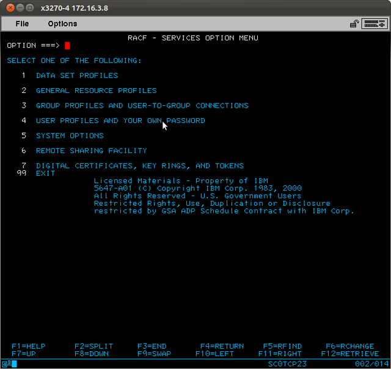
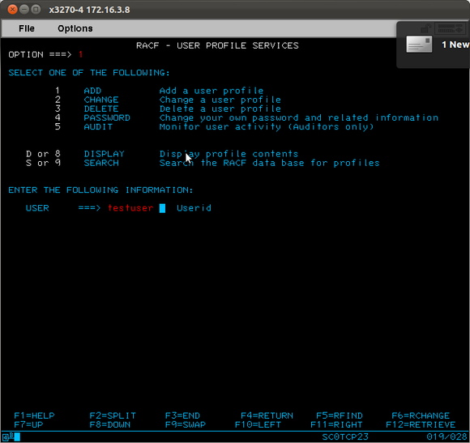
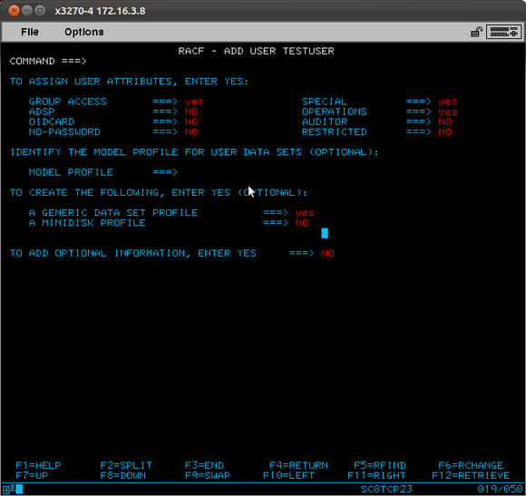
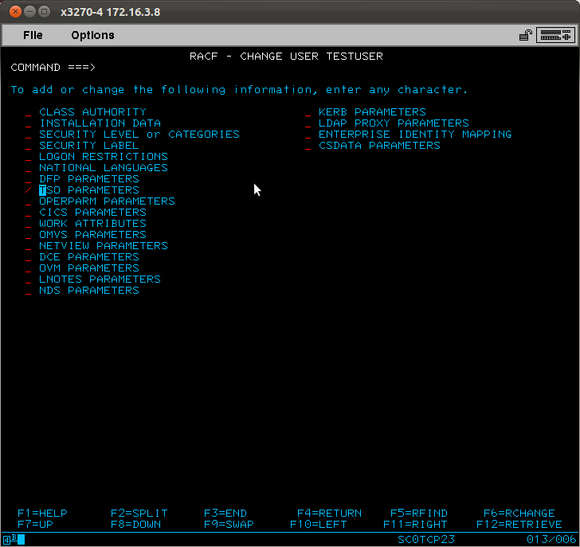
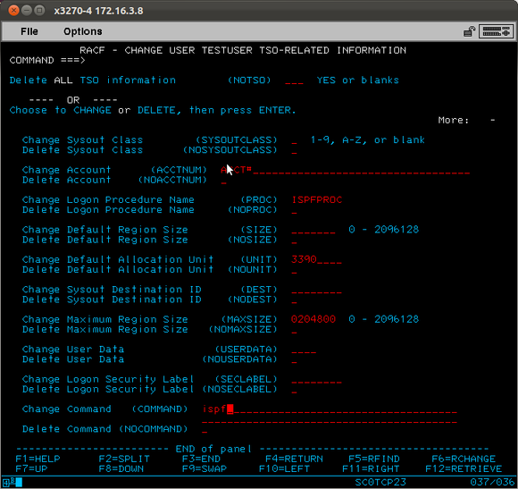
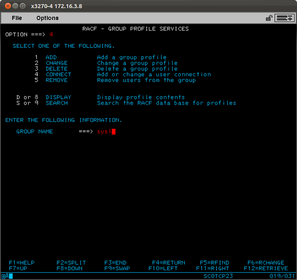
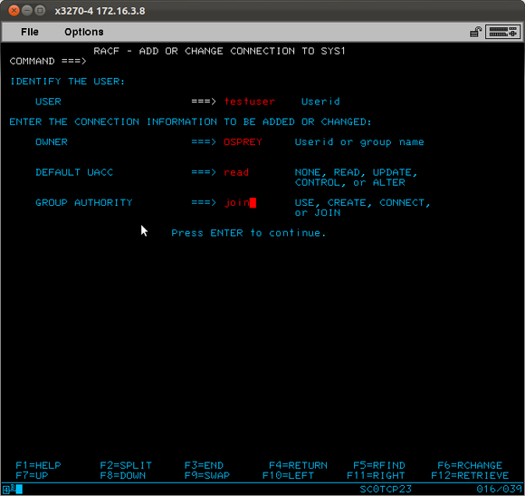
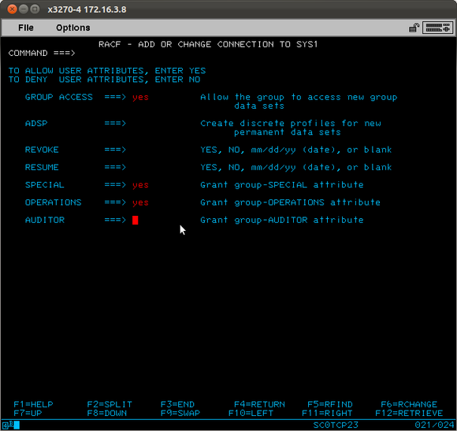
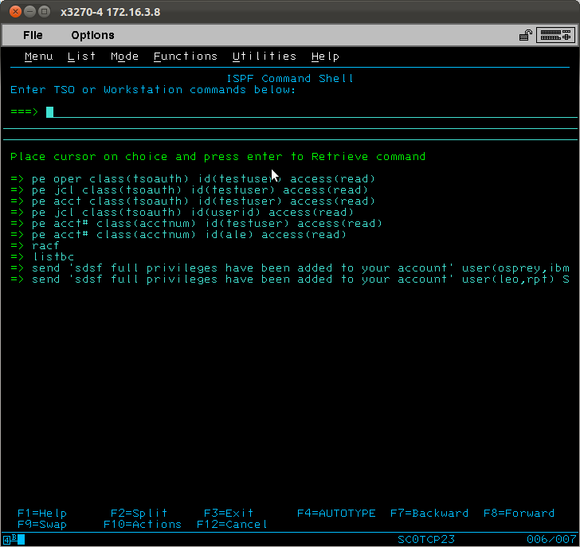

How to add users to TSO on z/OS
===============================

(archived from http://patata.homeip.net/blog/add-users-to-mvs)

Since it's not something i do every day I'll wrote down this little howto also for my own reference.

Create a user with full privileges on TSO
-----------------------------------------

Go to RACF



And then choose to create a user






The specified options grant full access to the system, in particular the SPECIAL and OPERATIONS grant a very high privilege level.

You need to specify the TSO parameters in order to allow the logon of the user, so add the following optional information.





The user is now created with the RACF definitions for TSO, but the work is still not completed. You need to link the user to the proper groups in order to have the permissions to log in and use the datasets.

The involved groups are `sys1`, `sysctlg` and `vsamdset`. Since we are creating a full administrative user we could give read as default uacc and join for the group authority.







Do the same for the remaining groups.

Now the user is almost ready, but you still have to grant some permissions in order to use the acct# and the rights to use SDSF. You just have to use these commands on the TSO prompt

Permit the use of acct, oper and jcl with the following commands

```
pe acct# class(acctnum) id(userid) access(read)

pe acct class(tsoauth) id(userid) access(read)

pe jcl class(tsoauth) id(userid) access(read)

pe oper class(tsoauth) id(userid) access(read)
```



At this point the new user can log on the TSO and have full rights to system datasets, JCL and SDSF.

*Note:* If the TSO logon asks for an account number, give it `acct#` ;)

